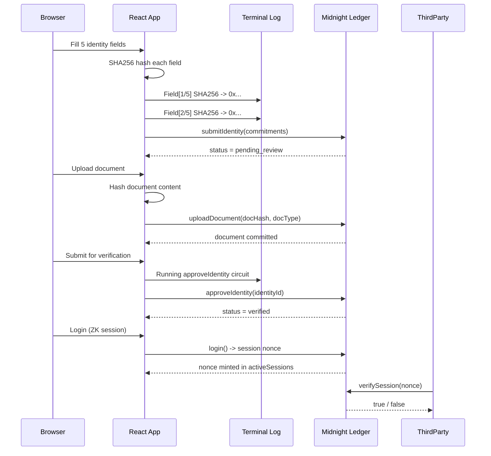
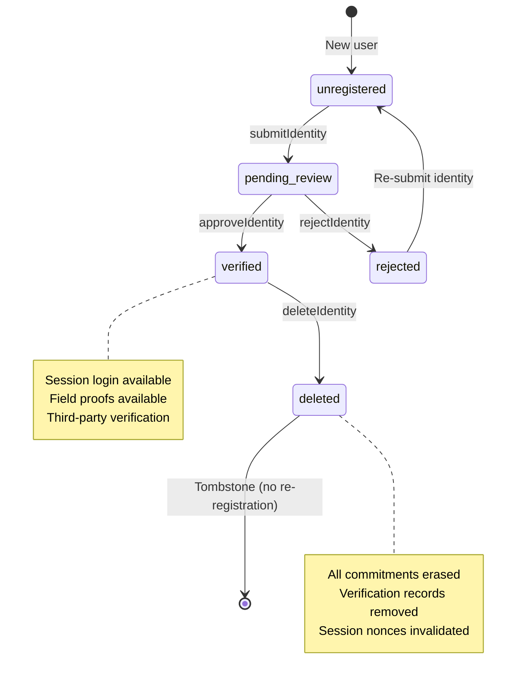
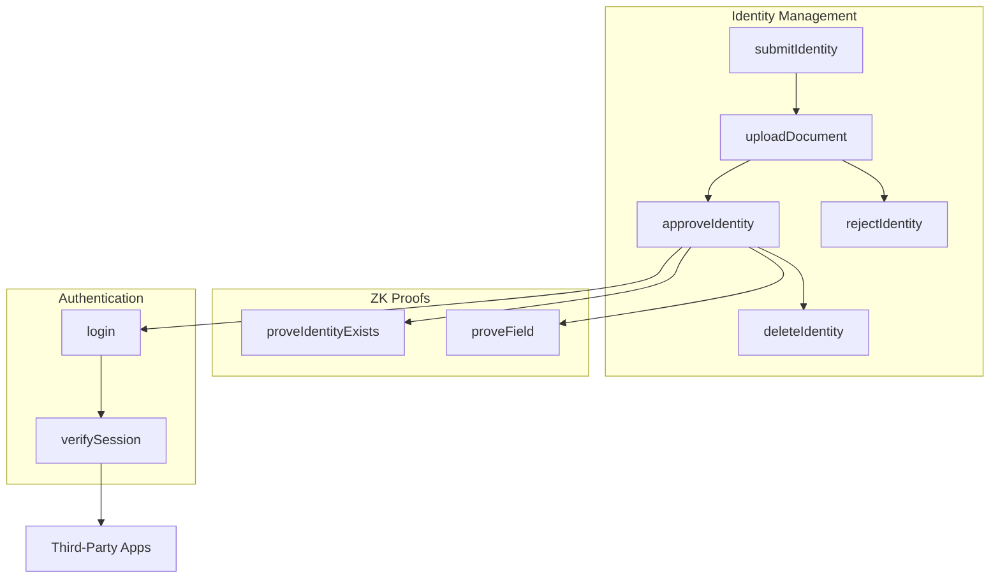
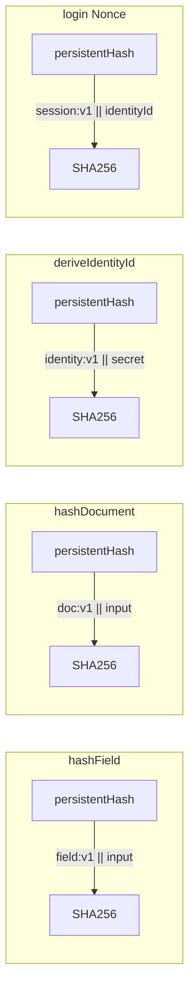
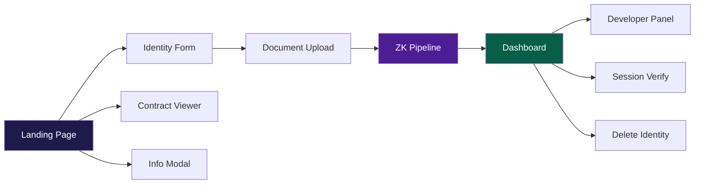
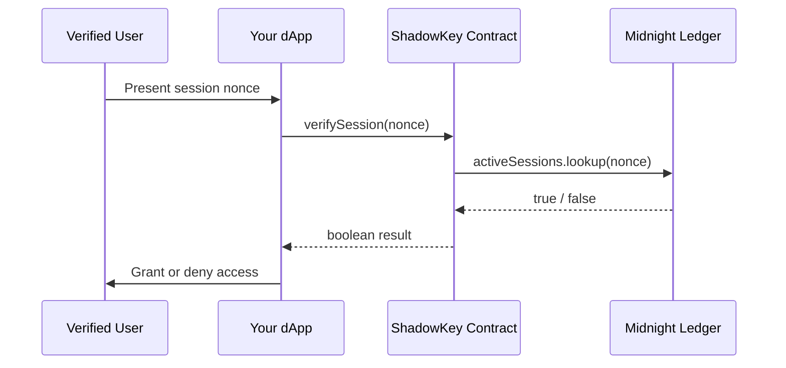

```
                                                              ,--.----.----.----.----.----.
     _______  __   __       _______  ______                     \      \    /    /    /    /
    |   _   ||  |_|  |     |   _   ||      |                    \     /          /    /
    |  |_|  ||       |     |  |_|  ||  _    |     ──────────    \   /   SHADOWKEY   /
    |   _   ||   _   |     |   _   || | |   |                    \ /    —— ZK ——  /
    |  | |  ||  | |  |     |  | |  || |_|   |                     '----.----.----'
    |__| |__||__| |__|     |__| |__||______/     IDENTITY VERIFICATION ON MIDNIGHT NETWORK

```

<p align="center">
  <strong>Zero-Knowledge Identity Verification on Midnight Network</strong>
  <br />
  <sub>Prove your identity without revealing it. Nine Groth16 circuits. One privacy guarantee.</sub>
</p>

<br />

---

<br />

<details>
  <summary><strong>Table of Contents</strong></summary>
  <br />
  <ul>
    <li><a href="#overview">Overview</a></li>
    <li><a href="#architecture">Architecture</a></li>
    <li><a href="#identity-lifecycle">Identity Lifecycle</a></li>
    <li><a href="#smart-contract">Smart Contract</a></li>
    <li><a href="#user-interface">User Interface</a></li>
    <li><a href="#getting-started">Getting Started</a></li>
    <li><a href="#developer-integration">Developer Integration</a></li>
    <li><a href="#security-model">Security Model</a></li>
    <li><a href="#project-structure">Project Structure</a></li>
  </ul>
</details>

<br />

---

<br />

## Overview

```
  ┌─────────────────────────────────────────────────────────────────────────────┐
  │                                                                             │
  │  THE PROBLEM                                                                │
  │                                                                             │
  │  Identity verification today requires surrendering personal data to         │
  │  third parties who store it indefinitely on centralized servers.            │
  │  This creates honeypots for attackers and fundamentally violates            │
  │  the principle of data minimization.                                       │
  │                                                                             │
  │  THE SOLUTION                                                               │
  │                                                                             │
  │  ShadowKey inverts this model. Instead of transmitting personal data        │
  │  for verification, users generate zero-knowledge proofs in their            │
  │  browser that demonstrate they meet verification criteria -- without        │
  │  ever revealing the underlying data.                                       │
  │                                                                             │
  │  THE NETWORK                                                                │
  │                                                                             │
  │  Built on Midnight Network, a data-protection-focused blockchain that       │
  │  natively supports zero-knowledge smart contracts through the Compact       │
  │  language. Midnight provides shielded execution with public verification.   │
  │                                                                             │
  └─────────────────────────────────────────────────────────────────────────────┘
```

### Key Differentiators

| vs Traditional KYC | ShadowKey |
|---|---|
| Personal data transmitted to servers | Data stays in the browser |
| Centralized database honeypot | Only SHA256 commitments on ledger |
| No user control over data deletion | One-click privacy erasure |
| Repeated KYC per application | Single verification, reusable sessions |
| Opaque verification logic | Auditable open-source circuits |

### Core Capabilities

- **Identity Submission**: Five identity fields (name, date of birth, nationality, address, ID number) are individually SHA256-hashed in the browser. Only commitments reach the ledger.
- **Document Commitment**: Supporting documents (passport, driver's license, ID card, utility bill, bank statement) are committed via hash. Raw files never leave the device.
- **Verification Workflow**: A trusted verifier oracle reviews documents out-of-band and approves or rejects via dedicated ZK circuits.
- **ZK Authentication**: Verified users generate session nonces by proving membership in the verified set without revealing their specific identity.
- **Privacy Erasure**: Users delete all on-chain data with a single circuit call. Identity commitments, document records, verification status, and session tokens are removed. A tombstone prevents re-registration.

<br />

---

<br />

## Architecture

```
  ┌─────────────────────────────────────────────────────────────────────────┐
  │                    LAYER 1: BROWSER APPLICATION                         │
  │                                                                         │
  │  ┌──────────────┐  ┌───────────┐  ┌──────────────┐  ┌──────────────┐   │
  │  │ Landing Page  │  │Identity   │  │ Document     │  │ Dashboard    │   │
  │  │ (marketing)   │  │Form (5    │  │ Upload (drag │  │ (status,     │   │
  │  │               │  │ fields)   │  │  & drop)     │  │  session)    │   │
  │  └──────────────┘  └───────────┘  └──────────────┘  └──────────────┘   │
  │         │                │               │                │             │
  │         └────────────────┼───────────────┼────────────────┘             │
  │                          │               │                              │
  │                    ┌─────┴───────────────┴─────┐                        │
  │                    │     useContract Hook       │                        │
  │                    │  (simulated or live mode)  │                        │
  │                    └───────────┬───────────────┘                        │
  │                                │                                        │
  │                    ┌───────────┴───────────────┐                        │
  │                    │     Terminal Log           │                        │
  │                    │  (live crypto operations)  │                        │
  │                    └───────────────────────────┘                        │
  └──────────────────────────────────┬──────────────────────────────────────┘
                                     │
  ┌──────────────────────────────────┴──────────────────────────────────────┐
  │                    LAYER 2: ZK PROOF SYSTEM                             │
  │                                                                         │
  │  ┌────────────┐  ┌───────────┐  ┌────────────┐  ┌──────────────────┐   │
  │  │submitIdty  │  │uploadDoc  │  │approveIdty │  │ rejectIdentity   │   │
  │  │ (9,216 r.) │  │(4,096 r.) │  │ (7,168 r.) │  │ (4,096 r.)       │   │
  │  └────────────┘  └───────────┘  └────────────┘  └──────────────────┘   │
  │                                                                         │
  │  ┌────────────┐  ┌───────────┐  ┌────────────┐  ┌──────────────────┐   │
  │  │deleteIdty  │  │proveExists│  │ proveField  │  │   login (ZK     │   │
  │  │ (3,072 r.) │  │(2,048 r.) │  │ (4,096 r.)  │  │  mint session)  │   │
  │  └────────────┘  └───────────┘  └────────────┘  └──────────────────┘   │
  │                                                    │                    │
  │                                          ┌─────────┴─────────┐          │
  │                                          │  verifySession    │          │
  │                                          │   (305 rows)      │          │
  │                                          └───────────────────┘          │
  │                                                                         │
  │  All Circuits: Groth16 over BLS12-381 | Compact 0.31.0                  │
  │  Domain Separation: field:v1, doc:v1, identity:v1, session:v1           │
  └──────────────────────────────────┬──────────────────────────────────────┘
                                     │
  ┌──────────────────────────────────┴──────────────────────────────────────┐
  │                    LAYER 3: MIDNIGHT LEDGER                             │
  │                                                                         │
  │  identityCommits  identityStatuses  documentCommits  verifiedIdentities │
  │  ┌──────────────┐ ┌───────────────┐ ┌──────────────┐ ┌────────────────┐│
  │  │ id -> Commit  │ │ id -> 0..4   │ │ docId -> Rec │ │ id -> bool     ││
  │  └──────────────┘ └───────────────┘ └──────────────┘ └────────────────┘│
  │                                                                         │
  │  verificationRecords  deletedIdentities  activeSessions                 │
  │  ┌──────────────────┐ ┌────────────────┐ ┌─────────────────┐           │
  │  │ id -> VerifRec   │ │ id -> bool     │ │ nonce -> bool   │           │
  │  └──────────────────┘ └────────────────┘ └─────────────────┘           │
  │                                                                         │
  │  totalRegistered: Counter    totalVerified: Counter                     │
  └─────────────────────────────────────────────────────────────────────────┘
```

### Component Interaction Flow



<br />

---

<br />

## Identity Lifecycle



### State Machine Transitions

| From | To | Circuit | Trigger |
|---|---|---|---|
| unregistered (0) | pending_review (1) | `submitIdentity` | User submits 5 identity fields |
| pending_review (1) | verified (2) | `approveIdentity` | Verifier approves documents |
| pending_review (1) | rejected (3) | `rejectIdentity` | Verifier rejects documents |
| verified (2) | deleted (4) | `deleteIdentity` | User requests erasure |
| rejected (3) | unregistered (0) | `submitIdentity` | User re-submits with corrections |

After deletion (state 4), the identity ID enters the `deletedIdentities` tombstone set. Any subsequent `submitIdentity` call with the same identity fails with `assert(deletedIdentities.lookup(...) != true)`.

<br />

---

<br />

## Smart Contract

The contract is written in **Compact 0.31.0** and consists of **202 lines** across **nine Groth16 zero-knowledge circuits**. It imports the Compact Standard Library and uses domain-separated `persistentHash` primitives throughout.

### Ledger State

| Map | Key | Value | Purpose |
|---|---|---|---|
| `identityCommits` | `disclosedId` | `IdentityCommit { nameHash, dobHash, nationalityHash, addressHash, idNumberHash }` | Stores hashed identity fields |
| `identityStatuses` | `disclosedId` | `Field` (0-4) | Current state in the identity lifecycle |
| `documentCommits` | `disclosedDocId` | `DocumentRecord { docHash, docType }` | Committed document hashes |
| `verifiedIdentities` | `disclosedId` | `Boolean` | Set of approved identities |
| `verificationRecords` | `disclosedId` | `VerificationRecord { identityId, verifiedAt, expiresAt }` | Verification metadata |
| `deletedIdentities` | `disclosedId` | `Boolean` | Tombstone set for erased identities |
| `activeSessions` | `disclosedNonce` | `Boolean` | Active session tokens |

### Circuit Catalog



#### submitIdentity (9,216 rows)

```compact
export circuit submitIdentity(
  nameRaw: Bytes<32>,      dobRaw: Bytes<32>,
  nationalityRaw: Bytes<32>, addressRaw: Bytes<32>,
  idNumberRaw: Bytes<32>
): [] {
  const identityId = deriveIdentityId(getIdentitySecret());
  const disclosedId = disclose(identityId);
  assert(deletedIdentities.lookup(disclosedId) != true, "Deleted.");
  identityCommits.insert(disclosedId, IdentityCommit {
    nameHash: disclose(hashField(nameRaw)),
    dobHash: disclose(hashField(dobRaw)),
    nationalityHash: disclose(hashField(nationalityRaw)),
    addressHash: disclose(hashField(addressRaw)),
    idNumberHash: disclose(hashField(idNumberRaw))
  });
  identityStatuses.insert(disclosedId, 1);
  totalRegistered.increment(1);
}
```

The identity is derived from a **secret witness** (`getIdentitySecret()`) rather than passed as an input. This cryptographically binds the identity to the caller without requiring address-based authentication. Each field is individually hashed through `hashField`, which applies the `field:v1` domain prefix.

#### uploadDocument (4,096 rows)

```compact
export circuit uploadDocument(docRaw: Bytes<32>, docType: Field): [] {
  const identityId = deriveIdentityId(getIdentitySecret());
  const disclosedId = disclose(identityId);
  assert(deletedIdentities.lookup(disclosedId) != true, "Deleted.");
  const docId = persistentHash<Vector<2, Bytes<32>>>([
    disclose(identityId), hashDocument(docRaw)
  ]);
  documentCommits.insert(disclose(docId), DocumentRecord {
    docHash: disclose(hashDocument(docRaw)),
    docType: disclose(docType)
  });
}
```

Each document is bound to the identity through a composite hash of the identity ID and document content. This prevents document swapping attacks where a verified document could be assigned to a different identity.

#### proveField (4,096 rows)

```compact
export circuit proveField(identityId: Bytes<32>, fieldValue: Bytes<32>): Boolean {
  const disclosedId = disclose(identityId);
  assert(verifiedIdentities.lookup(disclosedId) == true, "Not verified.");
  assert(deletedIdentities.lookup(disclosedId) != true, "Deleted.");
  const commit = identityCommits.lookup(disclosedId);
  const actualHash = hashField(fieldValue);
  return verifyFieldMatch(commit, actualHash);
}
```

Enables selective disclosure of individual identity fields. A user can prove their nationality without revealing their name, or prove their age without revealing their address.

#### login (8,080 rows)

```compact
export circuit login(): Bytes<32> {
  const identityId = deriveIdentityId(getIdentitySecret());
  const disclosedId = disclose(identityId);
  assert(verifiedIdentities.lookup(disclosedId) == true, "Not verified.");
  assert(deletedIdentities.lookup(disclosedId) != true, "Deleted.");
  const nonce = persistentHash<Vector<2, Bytes<32>>>([
    pad(32, "shadowkey:session:v1"), identityId
  ]);
  activeSessions.insert(disclose(nonce), true);
  return disclose(nonce);
}
```

Generates a deterministic session nonce bound to the user's identity. The session prefix `shadowkey:session:v1` ensures domain separation from identity and field hashes. The nonce is stored in `activeSessions` for verification by third-party applications.

#### verifySession (305 rows)

```compact
export circuit verifySession(nonce: Bytes<32>): Boolean {
  const disclosedNonce = disclose(nonce);
  return activeSessions.lookup(disclosedNonce) == true;
}
```

The smallest circuit at **305 rows** -- designed for minimal on-chain verification cost. Third-party applications call this circuit to verify a user's session token with a single boolean response.

#### deleteIdentity (3,072 rows)

```compact
export circuit deleteIdentity(identityId: Bytes<32>): [] {
  const disclosedId = disclose(identityId);
  assert(verifiedIdentities.lookup(disclosedId) == true, "Not verified.");
  identityCommits.remove(disclosedId);
  identityStatuses.remove(disclosedId);
  verifiedIdentities.remove(disclosedId);
  verificationRecords.remove(disclosedId);
  deletedIdentities.insert(disclosedId, true);
}
```

Removes every on-chain record associated with the identity and inserts a tombstone. This implements **right to erasure** at the protocol level.

### Domain Separation



All four hash prefixes are distinct and non-overlapping, preventing cross-protocol hash reuse.

<br />

---

<br />

## User Interface

The application provides a complete user experience with **seven major views**, all rendered with consistent dark theming, animated transitions, and real-time cryptographic feedback.

### Application Flow



### View Catalog

| View | Component | Lines | Key Features |
|---|---|---|---|
| Landing Page | `LandingPage.tsx` | 635 | 40 particles, typewriter, 3D tilt, scroll progress, 6 feature cards, 5-step timeline, 3-layer architecture, security grid |
| Identity Form | `IdentityForm.tsx` | 154 | 5 fields, per-field validation, SHA256 visualization, loading guard |
| Document Upload | `DocumentUpload.tsx` | 214 | 5 doc types, drag-and-drop, MIME + size validation, status tracking |
| ZK Pipeline | `App.tsx` (inline) | — | 5 animated stages, progress bars, circuit details |
| Dashboard | `Dashboard.tsx` | 254 | Status badge, document list, session login, verify/delete controls |
| Developer Panel | `DeveloperPanel.tsx` | 232 | Credential gen, code snippets, test playground |
| Terminal Log | `TerminalLog.tsx` | — | 6 color-coded levels, auto-scroll, clear |

<br />

---

<br />

## Getting Started

### Prerequisites

```
Node.js >= 18
npm >= 10
Lace Wallet (Midnight Preview) -- optional, for live transactions
```

### Quick Start

```bash
# Clone and enter the repository
git clone https://github.com/atharvmantri/ShadowKey.git
cd ShadowKey

# Install all workspace dependencies
npm install

# Build the UI application
cd shadowkey-ui
npm run build

# Start the development server
npm run dev
```

### Demo Mode

The application runs in **demo mode** out of the box without a wallet connection. Click **Demo** on the wallet button to simulate a connected wallet with mock balances. All identity operations, document uploads, verification workflows, and session management work in demo mode using in-memory state simulation with animated cryptographic feedback.

### Lace Wallet Connection

For live Midnight testnet transactions, install **Lace Wallet (Midnight Preview)** from the Chrome Web Store. The application automatically detects the wallet provider using UUID key iteration and supports network fallback through `preview`, `preprod`, and `devnet`.

<br />

---

<br />

## Developer Integration

ShadowKey is designed for frictionless integration by third-party applications. The verification flow requires a **single on-chain query** returning a boolean.

### Integration Architecture



### Integration Code

```typescript
import { ShadowKeyContract } from '@shadowkey/contract';

const CONTRACT_ADDRESS = '0x1a2b3c4d5e6f7a8b9c0d1e2f3a4b5c6d7e8f9a0b';

export async function verifyUserSession(
  sessionNonce: string
): Promise<boolean> {
  const contract = await ShadowKeyContract.deploy(
    wallet,
    { address: CONTRACT_ADDRESS }
  );
  const valid = await contract.verifySession(sessionNonce);
  return valid; // true = verified user
}

// Express.js API route
app.post('/api/auth/verify', async (req, res) => {
  const { sessionToken } = req.body;
  const authorized = await verifyUserSession(sessionToken);
  res.json({ authorized, timestamp: Date.now() });
});
```

### Integration Benefits

| Benefit | Description |
|---|---|
| **No PII Exposure** | `verifySession()` returns a boolean. No name, DOB, address, or document data ever enters your application. |
| **Single Function Call** | No SDK initialization, no state management, no webhook configuration. One query. One boolean. |
| **Self-Sovereign Identity** | Users register once with ShadowKey and reuse their verified status across any integrated application. No repeated KYC submissions. |
| **Open Source** | The full contract source code is available for audit, fork, and customization under the Apache 2.0 license. |

> "The user's identity data never touches my servers. I just check a boolean on Midnight. That's it." -- Hypothetical integrator

<br />

---

<br />

## Security Model

### Zero-Knowledge Guarantees

```
┌─────────────────────────────────────────────────────────────────────┐
│                                                                     │
│  ZERO-KNOWLEDGE                                                     │
│  A proof reveals only the truth of the statement being proved.      │
│  For verifySession, the verifier learns only whether the nonce      │
│  is valid -- nothing about the user's identity or personal data.    │
│                                                                     │
│  SOUNDNESS                                                           │
│  No computationally bounded prover can produce a valid proof        │
│  for a false statement. Guaranteed by Groth16 and R1CS.             │
│                                                                     │
│  COMPLETENESS                                                        │
│  An honest prover with a valid witness always succeeds in           │
│  generating an accepting proof.                                     │
│                                                                     │
└─────────────────────────────────────────────────────────────────────┘
```

### Data Protection Flow

```
  User's Browser                          Midnight Ledger
  ──────────────────────────────────────────────────────────────
  Full Name: "John Doe"          ──SHA256──>  0x7a3b...c9f2
  DOB: "1990-01-01"              ──SHA256──>  0x1e4f...b8a3
  Nationality: "US"              ──SHA256──>  0x9c2d...f1e7
  Address: "123 Main St"         ──SHA256──>  0x4b6a...3d8c
  ID Number: "A123456789"        ──SHA256──>  0xf8e7...2b1a

  │                                       │
  │  Raw data NEVER transmitted           │  Only 32-byte hashes stored
  │  Source files stay on device          │  Identities linkable only via disclosed ID
  │  Session proofs reveal nothing        │  Verification status = boolean
  └───────────────────────────────────────┴────────────────────────────────
```

### Security Properties

| Property | Implementation |
|---|---|
| Data Minimization | Only SHA256 commitments stored on-chain |
| Client-Side Hashing | Identity fields hashed in browser before any network call |
| Domain Separation | Four distinct `persistentHash` prefixes prevent collision |
| Selective Disclosure | `proveField` reveals a single field without exposing others |
| Forward Secrecy | `deleteIdentity` erases all commitments; tombstone prevents re-registration |
| Non-Interactive Verification | `verifySession` requires no interaction from the identity owner |
| Auditability | Full Compact source available; Groth16 public verifiers |

<br />

---

<br />

## Project Structure

```
ShadowKey/
│
├── shadowkey-contract/                # Midnight Compact smart contract
│   ├── src/
│   │   ├── shadowkey.compact          # 202 lines, 9 ZK circuits
│   │   └── managed/                   # Compiled artifacts (keys, zkir)
│   ├── package.json
│   └── tsconfig.json
│
├── shadowkey-ui/                      # React 19 frontend
│   ├── src/
│   │   ├── components/
│   │   │   ├── LandingPage.tsx        # 635-line marketing page
│   │   │   ├── IdentityForm.tsx       # 5-field identity form
│   │   │   ├── DocumentUpload.tsx     # Drag-and-drop document manager
│   │   │   ├── Dashboard.tsx          # Post-verification panel
│   │   │   ├── DeveloperPanel.tsx     # Integration toolkit
│   │   │   ├── TerminalLog.tsx        # Live operations log
│   │   │   ├── WalletConnect.tsx      # Lace wallet connector
│   │   │   └── ui/                    # Base UI primitives
│   │   ├── hooks/
│   │   │   ├── useContract.ts         # Contract interaction layer
│   │   │   └── useWallet.ts           # Wallet management
│   │   ├── App.tsx                    # Application root + wizard
│   │   └── main.tsx                   # Entry point (lazy loaded)
│   ├── index.html
│   ├── vite.config.ts
│   └── package.json
│
├── vercel.json                        # Vercel deployment config
└── package.json                       # npm workspace root
```

### Technology Stack

| Layer | Technology | Version |
|---|---|---|
| Smart Contract | Midnight Compact | 0.31.0 |
| Proving System | Groth16 over BLS12-381 | — |
| Frontend Framework | React | 19.1.0 |
| Animation Engine | Framer Motion | 12.38.0 |
| Styling | Tailwind CSS | 4.1.10 |
| Icons | Lucide React | 0.517.0 |
| Build Tool | Vite | 6.3.5 |
| Wallet | Lace Wallet SDK | 4.x |
| Package Manager | npm Workspaces | 10.x |
| Deployment | Vercel | — |

---

```
     ███████  ██░ ██████   ██████  ██    ██ ██   ██ ███████ ██    ██
     ██      ███ ██▄  ██ ██       ██    ██ ██   ██ ██       ██  ██
     ███████  ██ ████ ██ ██   ███ ██    ██ ███████ █████     ████
          ██  ██ ██▄  ██ ██    ██ ██    ██ ██   ██ ██         ██
     ███████  ██ ██████   ██████   ██████  ██   ██ ███████    ██

     Zero-Knowledge Identity Verification on Midnight Network
```
