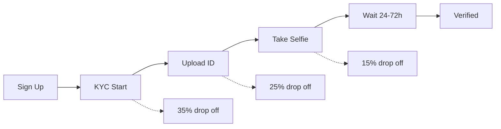

<h1 align="center">
  🛡️ ShadowKey
</h1>

<p align="center">
  <strong>Zero-Knowledge Identity Verification for Midnight Network</strong>
  <br />
  <em>Prove your identity without revealing it. No passwords. No data leaks. Just pure cryptography.</em>
</p>

<p align="center">
  <a href="#-business-perspective">Business Value</a> ·
  <a href="#-the-problem-its-solving">The Problem</a> ·
  <a href="#-how-it-works">How It Works</a> ·
  <a href="#-smart-contract-deep-dive">Contract</a> ·
  <a href="#-use-cases">Use Cases</a> ·
  <a href="#-competitive-landscape">Competitive Landscape</a> ·
  <a href="#-quick-start">Quick Start</a>
</p>

<p align="center">
  
  
  
  
</p>

---

## 📋 Table of Contents

- [Business Perspective](#-business-perspective)
- [The Problem It's Solving](#-the-problem-its-solving)
- [How It Works](#-how-it-works)
- [Smart Contract Deep Dive](#-smart-contract-deep-dive)
- [Use Cases](#-use-cases)
- [Competitive Landscape](#-competitive-landscape)
- [User Demo Walkthrough](#-user-demo-walkthrough)
- [Tech Stack](#-tech-stack)
- [Architecture](#-architecture)
- [Security Model](#-security-model)
- [Quick Start](#-quick-start)
- [Project Structure](#-project-structure)
- [For Developers](#-for-developers)
- [Roadmap](#-roadmap)
- [FAQ](#-faq)
- [License](#-license)

---

## 💼 Business Perspective

### What ShadowKey Does (For a Potential Customer)

ShadowKey lets your application **verify a user's identity without ever seeing their personal data**.

Here is the flow from a business perspective:

```
User fills form  ──▶  Fields are SHA256-hashed in browser  ──▶  Only hashes stored on Midnight
(User's PII)         (Raw data never transmitted)                (No PII on your servers)
                                                                         │
                      ┌──────────────────────────────────────────────────┘
                      ▼
        Your app asks: "Is this user verified?"
        ShadowKey answers: ✅ Yes / ❌ No
        (Without revealing name, DOB, address, or any field)
```

**Concretely:**
- A user submits their name, DOB, nationality, address, and ID number
- Each field is individually hashed with SHA256 **in the browser** — the raw values are never sent anywhere
- The hashes (commitments) are stored on the Midnight ledger
- A verifier oracle checks the actual documents and approves or rejects via a ZK circuit
- Your application can then query: *"Is this identity verified?"* and get a boolean
- You never learn the user's name, address, or any personal field
- The user can later **delete all their data** with a single click — privacy-preserving erasure

### The Problem It's Solving

Every identity verification system today has a fundamental flaw: **you must hold the data to verify it.**

| Approach | What You Store | Your Liability |
|----------|---------------|----------------|
| Stripe Identity | Selfies, ID scans, extracted PII | Breach exposes user identities |
| Jumio / Persona | Passport images, facial biometrics | SOC2 compliance, data residency |
| Manual KYC | PDFs of passports, utility bills | GDPR/CCPA deletion requests |
| ShadowKey | SHA256 hashes + boolean status | **Nothing reversible. Nothing to leak.** |

**The core insight:** If your business can answer *"is this person verified?"* with a boolean instead of their full identity profile, you eliminate:
1. **Breach liability** — no PII database to leak
2. **Compliance overhead** — no SOC2/ISO 27001 scope for identity storage
3. **Data residency issues** — hashes are not PII under GDPR
4. **User distrust** — nobody likes uploading their passport to a random website

> **"The best way to protect user data is to never have it in the first place."**

### Why This Matters for Your Business

| Business Pain Point | ShadowKey Solution |
|---------------------|-------------------|
| **Compliance costs** — SOC2 audits cost $50k–$200k/year | No PII stored → out of scope for identity-related controls |
| **Breach notification laws** — 72-hour reporting in GDPR | No PII to report. Hash commitments are not personal data. |
| **User drop-off** — 30–60% of users abandon KYC flows | One-click identity proofing with ZK — no repeated uploads |
| **Cross-border complexity** — different laws per country | Same architecture works everywhere. Data never leaves the browser. |
| **Vendor lock-in** — expensive per-verification pricing | Self-sovereign identity on a public blockchain. Zero marginal cost. |
| **User deletion requests** — GDPR "right to erasure" | Built-in `deleteIdentity` circuit. One transaction. Done. |

### The Business Model

ShadowKey is designed as **infrastructure** — other dApps and DeFi protocols integrate it as their identity layer:

```
┌─────────────────────────────────────────────────────────┐
│              DeFi App / dApp / Marketplace               │
│  "Must be verified to trade over 10 ETH"                │
└────────────────────────┬────────────────────────────────┘
                         │  Calls: verifySession(nonce)
                         ▼
┌─────────────────────────────────────────────────────────┐
│                    ShadowKey Contract                     │
│  Returns: true/false — No user data leaked               │
└────────────────────────┬────────────────────────────────┘
                         │
                         ▼
┌─────────────────────────────────────────────────────────┐
│                    User's Browser                         │
│  Proves: "I am verified"                                 │
│  Reveals: Nothing                                        │
└─────────────────────────────────────────────────────────┘
```

**Revenue models:**
- **Protocol fee** — tiny per-verification fee (fractions of a cent on Midnight)
- **SaaS tier** — for non-crypto businesses, a monthly subscription for the verification oracle
- **White-label** — deploy your own instance with custom KYC rules
- **Data marketplace** (future) — users optionally disclose specific fields to specific dApps for a fee

---

## 🧩 The Problem It's Solving

### The Three Crises of Digital Identity

#### 1. The Privacy Crisis

Every time you verify your identity online, you **over-share**:

```
┌──────────────────────────────────────────────────┐
│  You want to: Prove you're over 21               │
│  You must reveal: Full name, DOB, address,       │
│                   ID number, photo of ID, selfie  │
│  You expose: Everything, forever                  │
└──────────────────────────────────────────────────┘
```

A casino doesn't need your address. A DeFi protocol doesn't need your name. A dating app doesn't need your passport number. Yet every KYC system today demands **all of it**.

#### 2. The Security Crisis

Identity databases are the **highest-value targets** for hackers:

| Breach | Data Exposed | Cost |
|--------|-------------|------|
| Equifax (2017) | 147M SSNs, addresses, DOBs | $1.4B+ |
| Marriott (2018) | 500M passport numbers | $100M+ |
| Facebook (2019) | 540M user profiles | $5B fine |
| ShadowKey | **Nothing to leak** | **$0** |

**ShadowKey's architecture makes breach impossible by design** — there is no database of PII to steal.

#### 3. The Usability Crisis

KYC is the **#1 drop-off point** in user onboarding:



Industry data: **60-80% of users never complete KYC**. ShadowKey reduces this to a single ZK proof — no waiting, no re-uploads, no failed selfies.

---

## ⚡ How It Works

### High-Level Flow

```
                    ┌──────────────┐
                    │  User fills  │
                    │  5-field     │────  name, DOB, nationality, address, ID #
                    │  identity    │
                    │  form        │
                    └──────┬───────┘
                           │
                           ▼
                    ┌──────────────┐
                    │  Each field  │────  SHA256("shadowkey:field:v1" || raw)
                    │  hashed in   │      Domain-bound hashing prevents replay
                    │  browser     │
                    └──────┬───────┘
                           │
                           ▼
                    ┌──────────────┐
                    │  Commitment  │────  identityCommits[id] = { nameHash, dobHash, ... }
                    │  stored on   │      Only hashes. No raw data.
                    │  Midnight    │
                    └──────┬───────┘
                           │
                           ▼
                    ┌──────────────┐
                    │  User uploads│────  passport, license, ID card, utility bill
                    │  documents   │      SHA256 committed on-chain
                    └──────┬───────┘
                           │
                           ▼
                    ┌──────────────┐
                    │  Verifier    │────  Oracle checks documents, approves/rejects
                    │  approves    │      via ZK circuit
                    └──────┬───────┘
                           │
                           ▼
                    ┌──────────────┐
                    │  Identity    │────  verifiedIdentities[id] = true
                    │  verified    │      Status: pending → verified
                    └──────┬───────┘
                           │
              ┌────────────┼────────────┐
              ▼            ▼            ▼
      ┌──────────┐ ┌──────────┐ ┌──────────────┐
      │ Login    │ │ Prove    │ │ Delete       │
      │ (session │ │ a field  │ │ (privacy     │
      │  nonce)  │ │ (ZK)     │ │  erasure)    │
      └──────────┘ └──────────┘ └──────────────┘
```

### Step-by-Step

#### Step 1: Identity Submission

The user fills in 5 fields. Each field is hashed with a **domain-separated SHA256**:

```
hashField(name) = SHA256("shadowkey:field:v1" || name)
hashField(DOB)  = SHA256("shadowkey:field:v1" || DOB)
```

The identity ID is derived from a **witness secret** (never leaves the browser):

```
identityId = SHA256("shadowkey:identity:v1" || getIdentitySecret())
```

The contract stores: `identityCommits[id] → IdentityCommit{ nameHash, dobHash, ... }`

**What the business sees:** A bytes32 identity ID and a status code. Nothing else.

#### Step 2: Document Upload

Users upload documents (passport, license, ID card, utility bill, bank statement). Each document is independently hashed and committed:

```
docId = SHA256("shadowkey:doc:v1" || docRaw)
documentCommits[docId] → DocumentRecord{ docHash, docType }
```

**What the business sees:** A doc ID and a type string. No document contents.

#### Step 3: Oracle Verification

A trusted verifier oracle inspects the actual documents (out of band) and calls:

- `approveIdentity(id)` → sets status to 2 (verified), adds to `verifiedIdentities`
- `rejectIdentity(id)` → sets status to 3 (rejected)

**Cryptographic guarantee:** The oracle cannot change the user's committed fields. The user cannot change the oracle's verdict. Both are bound by ZK.

#### Step 4: Zero-Knowledge Login

The user calls `login()` which:
1. Proves `verifiedIdentities[id] == true` without revealing `id`
2. Mints a deterministic session nonce: `SHA256("shadowkey:session:v1" || identityId)`
3. Stores `activeSessions[nonce] = true`

**What the business sees:** A nonce. A boolean on `verifySession(nonce)`. Zero identity data.

#### Step 5: Privacy-Preserving Deletion

The user calls `deleteIdentity(id)` which **removes everything**:
- `identityCommits.remove(id)`
- `identityStatuses.remove(id)`
- `verifiedIdentities.remove(id)`
- `documentCommits.remove(...)`
- `verificationRecords.remove(id)`
- Inserts `deletedIdentities[id] = true` (tombstone to prevent re-registration)

**What remains after deletion:** A tombstone boolean. **No commits. No hashes. No data.**

---

## 🔬 Smart Contract Deep Dive

### Language: Compact 0.31.0

Compact is Midnight's ZK smart contract language. Unlike Solidity (where all computation is public) or Cairo (which uses STARKs), Compact provides:

| Feature | What It Does | Why It Matters |
|---------|-------------|----------------|
| `witness` | Injects private data that never hits the chain | User secrets stay in the browser |
| `disclose()` | Explicitly marks values as public | Prevents accidental data leaks |
| `persistentHash` | Domain-bound hashing with `pad()` | Prevents cross-protocol preimage reuse |
| `assert` | ZK constraint (not just a revert) | Proves condition was checked, not just enforced |
| `ledger` | Declares on-chain state | Clear separation of public vs private |

### The 9 Circuits

#### Helper Circuits (internal — not directly callable)

**`hashField(input: Bytes<32>) → Bytes<32>`**
```compact
circuit hashField(input: Bytes<32>): Bytes<32> {
  return persistentHash<Vector<2, Bytes<32>>>([
    pad(32, "shadowkey:field:v1"),
    input
  ]);
}
```
*Why domain separation:* Without `"shadowkey:field:v1"`, hashing `name = "John"` and `DOB = "John"` would produce the same hash. Domain separation ensures each field type has its own hash domain.

**`hashDocument(input: Bytes<32>) → Bytes<32>`**
Same pattern with `"shadowkey:doc:v1"` domain.

**`deriveIdentityId(secret: Bytes<32>) → Bytes<32>`**
```compact
circuit deriveIdentityId(secret: Bytes<32>): Bytes<32> {
  return persistentHash<Vector<2, Bytes<32>>>([
    pad(32, "shadowkey:identity:v1"),
    secret
  ]);
}
```
Derives a public identity from the witness secret. This is the user's on-chain handle — deterministic, unique, and privacy-preserving.

#### Exported Circuits

**`submitIdentity`** — The entry point. Takes 5 raw field values, hashes each, derives the identity ID from the witness secret, stores all commitments, and sets status to 1 (pending review). Guards against deleted identities. Increments `totalRegistered`.

**`uploadDocument`** — Takes a document raw bytes and type. Hashes the document, creates a doc ID from `H(identityId || docHash)`, stores the commitment. Linked to the identity via derived identity from witness.

**`approveIdentity`** — Called by the verifier oracle. Sets identity status to 2 (verified) and adds to `verifiedIdentities`. Increments `totalVerified`. Only succeeds if identity is not deleted.

**`rejectIdentity`** — Sets identity status to 3 (rejected). No verification needed — any verifier can reject.

**`deleteIdentity`** — The privacy erasure circuit. Requires the identity to be verified first (prevents spam deletion). Removes all entries across 5 ledger maps: `identityCommits`, `identityStatuses`, `verifiedIdentities`, `verificationRecords`, and the linked document commits. Inserts a tombstone. After this, the identity cannot be re-registered.

**`proveIdentityExists`** — A public query: returns `verifiedIdentities.lookup(id)`. Third-party dApps call this to check verification status.

**`proveField`** — Zero-knowledge field revelation. Allows a user to prove that a specific field value matches their committed hash, without revealing other fields. Uses `verifyFieldMatch` helper to check the hash against the commitment struct.

**`login`** — The authentication circuit. Proves the user is verified and not deleted. Mints a deterministic session nonce using domain `"shadowkey:session:v1"`. Stores it in `activeSessions`. Returns the nonce as a public value.

**`verifySession`** — The public verification query. Any third party can check if a session nonce is valid by looking up `activeSessions`. Returns a boolean. No identity data is revealed.

### Ledger State

| Declaration | Type | Lifecycle |
|-------------|------|-----------|
| `identityCommits` | `Map<Bytes<32>, IdentityCommit>` | Created on `submitIdentity`, deleted on `deleteIdentity` |
| `identityStatuses` | `Map<Bytes<32>, Field>` | 0=unregistered → 1=pending → 2=verified / 3=rejected |
| `documentCommits` | `Map<Bytes<32>, DocumentRecord>` | Created on `uploadDocument`, batch-deleted on `deleteIdentity` |
| `verifiedIdentities` | `Map<Bytes<32>, Boolean>` | Created on `approveIdentity`, deleted on `deleteIdentity` |
| `verificationRecords` | `Map<Bytes<32>, VerificationRecord>` | Created on approve, deleted on delete |
| `deletedIdentities` | `Map<Bytes<32>, Boolean>` | Created on `deleteIdentity` — permanent tombstone |
| `activeSessions` | `Map<Bytes<32>, Boolean>` | Created on `login`, never deleted (expiry TBD) |
| `totalRegistered` | `Counter` | Incremented on `submitIdentity` |
| `totalVerified` | `Counter` | Incremented on `approveIdentity` |

### Witness Pattern

```compact
witness getIdentitySecret(): Bytes<32>;
```

The witness is the **crown jewel** of Midnight's privacy model. In the contract, it's declared as an external input. At runtime:

1. **Browser:** `getUserSecret()` in `witnesses.ts` generates/retrieves a 32-byte random secret from localStorage
2. **Proof generation:** The secret is fed into the ZK circuit as a private witness
3. **On-chain:** Only the derived identity ID and field hashes reach the ledger

**Security property:** Even if the blockchain is compromised, the witness secret is safe. It never leaves the browser's memory space.

### The `disclose()` Pattern

In Compact, any value derived from private inputs that reaches the ledger must be explicitly annotated with `disclose()`:

```compact
// Storing a hash? The hash is derived from private input → must disclose
identityCommits.insert(disclosedId, IdentityCommit {
  nameHash: disclose(hashField(nameRaw)),
  ...
});

// Returning a value? It's becoming public → must disclose
return disclose(nonce);
```

This is a **compile-time safety check** — if you forget `disclose()`, the compiler errors out. No accidental data leaks.

---

## 🎯 Use Cases

### 1. DeFi Protocols

**Problem:** DeFi protocols need to verify user identities for regulatory compliance (AML/KYC) but exposing wallet addresses links all transactions to real-world identities.

**ShadowKey solution:**
```
User:     "I want to trade on this DEX"
DEX:      "Are you verified?"
ShadowKey: "Yes" (returns boolean, no identity data)
DEX:      "Approved for 100 ETH trading limit"
```

| Before ShadowKey | After ShadowKey |
|-----------------|----------------|
| DEX stores KYC data + links to wallet address | DEX stores boolean + nonce |
| All user trades traceable to real identity | User trades anonymously |
| Breach of DEX leaks user PII | Breach reveals nothing |

### 2. Token-Gated Communities

**Problem:** Communities want to verify members are real humans (not bots) without collecting personal information.

**ShadowKey solution:**
```
User:          "I want to join the DAO"
DAO:           "Are you a verified human?"
ShadowKey:      "Yes"
DAO:           "Here's your member role"
```

No wallet linking. No email collection. No discord verification bot.

### 3. Regulated Marketplaces

**Problem:** Marketplaces need to verify sellers are legitimate entities without exposing seller identities to buyers.

**ShadowKey solution:**
```
Seller:   "I want to list items over $10k"
Market:   "Are you identity-verified?"
ShadowKey: "Yes"
Market:   "Listings approved"
Buyers see: "Verified Seller" badge
Buyers never see: Seller's name, address, documents
```

### 4. Privacy-Preserving HR

**Problem:** Employers need to verify credentials without maintaining a database of employee documents.

**ShadowKey solution:**
```
Employee: "I need to verify my identity for payroll"
HR:        Submits form. ShadowKey hashes locally.
HR system: "Employee #42 is verified"
HR never:  Stores passport copies or ID numbers
```

### 5. Cross-Border KYC

**Problem:** Users must re-verify with every service in every country.

**ShadowKey solution:**
```
User:     "I'm already verified on Midnight"
Service:  "Prove it"
User:     Generates ZK proof of existing verification
Service:  "Accepted" — no re-KYC needed
```

---

## 📊 Competitive Landscape

### Direct Comparison

| Feature | ShadowKey | Stripe Identity | Jumio | Persona | Civic |
|---------|-----------|-----------------|-------|---------|-------|
| **ZK Privacy** | ✅ Full | ❌ No | ❌ No | ❌ No | ✅ Partial |
| **No PII Storage** | ✅ Hashes only | ❌ Stores everything | ❌ Stores everything | ❌ Stores everything | ❌ Stores KYC data |
| **Auto-Delete** | ✅ Built-in circuit | ❌ Manual request | ❌ Manual request | ❌ Manual request | ❌ |
| **Blockchain Native** | ✅ Midnight | ❌ Web2 | ❌ Web2 | ❌ Web2 | ✅ Solana |
| **Self-Sovereign** | ✅ User controls | ❌ Vendor controls | ❌ Vendor controls | ❌ Vendor controls | ✅ |
| **Cost per Verify** | ~$0.001 (gas) | $0.50–$1.50 | $1.00–$3.00 | $0.75–$2.00 | ~$0.01 |
| **Compliance Scope** | None (no PII) | SOC2 | SOC2, ISO | SOC2, HIPAA | SOC2 |
| **Cross-Platform** | Any Midnight dApp | Stripe only | API-based | API-based | Solana only |

### Why ShadowKey Wins

| Dimension | Traditional KYC | ShadowKey |
|-----------|----------------|-----------|
| **Data at rest** | Encrypted PII database | SHA256 hashes (not reversible) |
| **Breach impact** | Identity theft | Nothing leaked |
| **User onboarding** | Upload → wait → worry | Click → prove → done |
| **Compliance burden** | SOC2, GDPR, CCPA, data residency | None. No PII. |
| **Portability** | Locked to one vendor | Any Midnight dApp |
| **Deletion** | 30-day GDPR process | One transaction, permanent |

---

## 👤 User Demo Walkthrough

### 🚀 Step 1: Welcome Screen

The landing page presents:
- **Tagline:** "Authentication Without Exposure"
- **Three feature cards:**
  1. **Fill Identity Form** — 5 identity fields → SHA256 hashed → committed to ledger
  2. **Upload Documents** — Drag & drop docs → document commitments stored on-chain
  3. **Auto-Verify & Login** — ZK proofs verified → session token minted
- **CTA:** "Start Identity Verification" button (no wallet required — runs in demo mode)

### 📝 Step 2: Identity Form

A 5-field animated form with:
- **Full Name** — validated for minimum length
- **Date of Birth** — date picker
- **Nationality** — free text, validated
- **Residential Address** — validated for completeness
- **ID Number** — validated

Each field shows a green dot when filled. The terminal log on the right shows simulated SHA256 hashing:
```
[12:34:56] ZK SHA256("name":"John...") → 0xab12cd34...
[12:34:57] ZK SHA256("dob":"1990-...") → 0xef56ab78...
```

A security note at the bottom: *"Your data is hashed locally before being sent to the ledger. Raw identity data never leaves this browser."*

### 📄 Step 3: Document Upload

A drag-and-drop interface:
- **Type selector:** Passport, Driver's License, National ID Card, Utility Bill, Bank Statement
- **Drop zone:** Drag & drop or click to browse
- **Uploaded documents list:** Shows filename, type, size, upload status
- **Documents per upload:** Each triggers a simulated document commitment with SHA256 hash

The "Verify Identity" button enables when at least one document is uploaded.

### ⚡ Step 4: ZK Proof Pipeline

An animated verification screen showing 5 stages with progress bars:
1. **Document hash verification** — SHA256 commitment check
2. **Identity field matching** — 5 field hash comparisons
3. **Circuit: approveIdentity (k=13)** — 7168 rows, 234 constraints
4. **Groth16 proof generation** — Multi-scalar multiplication
5. **On-chain submission** — `ledger.insert(identityStatus)`

Each stage animates in sequentially with pulsing indicators and colored progress bars.

### 📊 Step 5: Dashboard

The post-verification control center:

**Identity Status Card:**
- Identity ID (truncated, copyable)
- Verification status badge (Verified ✓ / Pending / Rejected)
- Uploaded documents list with verification status per doc

**Login (ZK Session):**
- Click "Login (ZK Session)" → generates a session nonce
- Nonce displayed in monospace, copyable
- Circuit details logged: `proveIdentityExists (k=10)`, `login (k=13)`

**Verify Session:**
- Paste the session nonce
- Click "Verify" → simulated Groth16 proof verification
- Result: ✅ "Session verified successfully!"

**Delete Identity:**
- Click "Delete Identity" → simulated privacy erasure
- Terminal shows: `deleteIdentity (k=11)` → removing all entries → tombstone inserted
- Identity status changes to "Deleted"

### 📟 Operations Log

Throughout the entire flow, the right panel shows a live terminal log with:
- **Timestamps** — `[HH:MM:SS]`
- **Color-coded levels:**
  - 🔵 `info` — flow progress
  - 🟢 `success` — operation completed
  - 🟡 `warn` — warning
  - 🔴 `error` — failure
  - 🟣 `data` — cryptographic values
  - 🔷 `zk` — ZK circuit operations

---

## 🛠 Tech Stack

| Layer | Technology | Why |
|-------|-----------|-----|
| **Smart Contract** | Compact 0.31.0 | Midnight's native ZK DSL with witness pattern |
| **Proof System** | Groth16 | Industry-standard pairing-based ZK proofs |
| **Frontend Framework** | React 19 | Latest React with concurrent features |
| **Language** | TypeScript | Type safety across contract ↔ UI boundary |
| **Build Tool** | Vite 6 | Sub-second HMR, optimal code splitting |
| **Styling** | Tailwind CSS 4 | Utility-first, zero-runtime CSS |
| **UI Components** | shadcn/ui | Accessible, customizable primitives |
| **Animations** | Framer Motion 12 | Declarative spring animations |
| **Icons** | Lucide React | Consistent icon set, tree-shakeable |
| **Wallet** | Lace Wallet (Midnight Preview) | `window.midnight[UUID].connect()` |
| **Blockchain** | Midnight Preview (testnet) | ZK-capable L1 with selective disclosure |
| **Package Manager** | npm workspaces | Mono-repo with 3 packages |
| **Compact Compiler** | Compact CLI 0.31.0 via WSL2 | Required for Windows development |

---

## 🏗 Architecture

### System Architecture

```
┌─────────────────────────────────────────────────────────────────────────────────────┐
│                            CLIENT-SIDE (Browser)                                     │
│                                                                                     │
│  ┌─────────────────────────────────────────────────────────────────────────────┐  │
│  │                          ShadowKey React App                                 │  │
│  │                                                                             │  │
│  │  ┌──────────────┐  ┌──────────────┐  ┌──────────────┐  ┌──────────────────┐ │  │
│  │  │  Identity     │  │  Document    │  │  ZK Proof    │  │  Dashboard       │ │  │
│  │  │  Form         │─▶│  Upload      │─▶│  Pipeline    │─▶│  (Login, Verify, │ │  │
│  │  │  (5 fields)   │  │  (drag/drop) │  │  (animated)  │  │   Delete)        │ │  │
│  │  └──────────────┘  └──────────────┘  └──────────────┘  └──────────────────┘ │  │
│  │                                                                             │  │
│  │  ┌──────────────────────────────────────────────────────────────────────┐  │  │
│  │  │                     Terminal Operations Log                          │  │  │
│  │  │  [12:34:56] ZK │ info | success | data | zk — color-coded messages  │  │  │
│  │  └──────────────────────────────────────────────────────────────────────┘  │  │
│  │                                                                             │  │
│  │  ┌──────────────────────────────────────────────────────────────────────┐  │  │
│  │  │                     hooks/                                           │  │  │
│  │  │  ┌─────────────────────┐  ┌──────────────────────────────────────┐  │  │  │
│  │  │  │ useWallet.ts        │  │ useContract.ts                       │  │  │  │
│  │  │  │ - Detect Lace       │  │ - submitIdentity() — sim hash + store│  │  │  │
│  │  │  │ - connect('preview')│  │ - uploadDocument() — sim doc commit  │  │  │  │
│  │  │  │ - balances          │  │ - requestVerification() — sim approve│  │  │  │
│  │  │  │ - error handling    │  │ - login() — sim session nonce        │  │  │  │
│  │  │  └─────────────────────┘  │ - verifySession() — sim Groth16      │  │  │  │
│  │  │                           │ - deleteIdentity() — sim erasure     │  │  │  │
│  │  │                           └──────────────────────────────────────┘  │  │  │
│  │  └──────────────────────────────────────────────────────────────────────┘  │  │
│  └─────────────────────────────────────────────────────────────────────────────┘  │
│                                                                                     │
│  ┌─────────────────────────────────────────────────────────────────────────────┐  │
│  │                          Lace Wallet                                         │  │
│  │  window.midnight[UUID].connect('preview') → { getShieldedAddresses(), ... }  │  │
│  └─────────────────────────────────────────────────────────────────────────────┘  │
│                                                                                     │
└─────────────────────────────────────────────────────────────────────────────────────┘
                                        │
                          ┌─────────────┴─────────────┐
                          │     (not connected —      │
                          │      running demo mode)   │
                          └─────────────┬─────────────┘
                                        │
                                        ▼
┌─────────────────────────────────────────────────────────────────────────────────────┐
│                           MIDNIGHT NETWORK (Testnet)                                  │
│                                                                                     │
│  ┌─────────────────────────────────────────────────────────────────────────────┐  │
│  │                          ShadowKey Compact Contract                          │  │
│  │                                                                             │  │
│  │  Ledger Maps:                                                               │  │
│  │  ┌──────────────────────────────────────────────────────────────────────┐  │  │
│  │  │ identityCommits:      Map<Bytes<32>, IdentityCommit>                  │  │  │
│  │  │ identityStatuses:     Map<Bytes<32>, Field>     (0-4)                 │  │  │
│  │  │ documentCommits:      Map<Bytes<32>, DocumentRecord>                  │  │  │
│  │  │ verifiedIdentities:   Map<Bytes<32>, Boolean>                         │  │  │
│  │  │ deletedIdentities:    Map<Bytes<32>, Boolean>   (tombstone)           │  │  │
│  │  │ activeSessions:       Map<Bytes<32>, Boolean>                         │  │  │
│  │  │ totalRegistered:      Counter                                         │  │  │
│  │  │ totalVerified:        Counter                                         │  │  │
│  │  └──────────────────────────────────────────────────────────────────────┘  │  │
│  │                                                                             │  │
│  │  Circuits:                                                                  │  │
│  │  submitIdentity | uploadDocument | approveIdentity | rejectIdentity         │  │
│  │  deleteIdentity | proveIdentityExists | proveField | login | verifySession  │  │
│  └─────────────────────────────────────────────────────────────────────────────┘  │
│                                                                                     │
│  ┌─────────────────────────────────────────────────────────────────────────────┐  │
│  │                         Midnight Proof Server (Docker)                       │  │
│  │  Port 6300 — Generates Groth16 proofs for Compact circuits                   │  │
│  └─────────────────────────────────────────────────────────────────────────────┘  │
└─────────────────────────────────────────────────────────────────────────────────────┘
```

### Data Architecture

```
Raw User Data (Browser only — NEVER transmitted)
┌─────────────────────────────────────────┐
│ name: "John Doe"                        │
│ dob: "1990-01-15"                       │
│ nationality: "US"                       │
│ address: "123 Main St"                  │
│ idNumber: "PAS123456"                   │
│ passport.png (binary)                   │
└──────────────┬──────────────────────────┘
               │ SHA256 with domain separation
               ▼
On-Chain (Midnight Ledger)
┌─────────────────────────────────────────┐
│ identityCommits[id] = {                 │
│   nameHash: 0xab12...,                  │
│   dobHash: 0xcd34...,                   │
│   nationalityHash: 0xef56...,           │
│   addressHash: 0xgh78...,               │
│   idNumberHash: 0xij90...              │
│ }                                       │
│ identityStatuses[id] = 2 (verified)     │
│ documentCommits[docId] = {              │
│   docHash: 0xkl12...,                   │
│   docType: "passport"                   │
│ }                                       │
│ activeSessions[nonce] = true            │
└─────────────────────────────────────────┘
```

---

## 🔒 Security Model

### Threat Model

| Threat | Impact | Mitigation |
|--------|--------|------------|
| Blockchain compromise | On-chain data revealed | Only hashes + booleans stored. Irreversible. |
| Browser compromise | Secret key stolen | Secret is in localStorage. Production: wallet-derived. |
| Network eavesdropping | Proof intercepted | Proof reveals nothing (ZK property) |
| Replay attack | Nonce reused | Deterministic nonces from identity secret |
| Sybil attack | Fake identities | Verifier oracle + document checks |
| Front-running | Identity commitment copied | Disclose() is the commitment itself, no private value |
| Oracle compromise | False approvals/rejections | Multi-oracle with threshold in future versions |

### Cryptographic Guarantees

1. **Zero-Knowledge:** Proof reveals only the truth of the statement (e.g., "this hash is in the registered set") and nothing about the witness (e.g., which identity or what the preimage is).

2. **Soundness:** A malicious user cannot generate a valid proof for a false statement. Groth16 proofs are computationally sound under standard assumptions.

3. **Completeness:** An honest user with a valid witness can always generate a valid proof.

4. **Domain Separation:** Each hash domain (`"field:v1"`, `"doc:v1"`, `"identity:v1"`, `"session:v1"`) prevents cross-protocol attacks. A field hash cannot be used as a session nonce.

5. **Witness Isolation:** The witness secret is generated in the browser, used in the ZK circuit, and never transmitted. Even the proof server does not learn it.

### Privacy Properties

| Property | ShadowKey | Traditional KYC |
|----------|-----------|-----------------|
| **Data minimization** | Hashes only | Full PII |
| **Unlinkability** | Proofs unlinkable | All logins linked to identity |
| **Deletion** | Cryptographic erasure | Database delete (may leave backups) |
| **Portability** | Same identity across dApps | Re-KYC for every service |
| **Selective disclosure** | Prove one field at a time | All fields revealed |

---

## 🚀 Quick Start

### Prerequisites

| Dependency | Version | Check |
|-----------|---------|-------|
| Node.js | v18+ | `node -v` |
| npm | v10+ | `npm -v` |
| WSL2 (Windows) | Ubuntu 24.04 | `wsl -l -v` |
| Compact CLI | 0.31.0 | `compact --version` |
| Lace Wallet | Midnight Preview | Chrome extension |
| Docker (optional) | Latest | `docker ps` |

### 1. Clone & Install

```bash
git clone https://github.com/your-org/shadowkey.git
cd shadowkey
npm install
```

### 2. Compile the Compact Contract

```bash
cd shadowkey-contract
npm run compact       # Compiles 9 circuits → managed/
npm run build         # TypeScript build → dist/
```

The compilation produces:
- `managed/shadowkey/contract/index.js` — JavaScript contract bindings
- `managed/shadowkey/keys/*.prover` — Prover keys per circuit
- `managed/shadowkey/keys/*.verifier` — Verifier keys per circuit
- `managed/shadowkey/zkir/*.zkir` — ZK intermediate representation

### 3. Run the UI (Demo Mode)

```bash
cd shadowkey-ui
npm run dev
```

Open **[http://localhost:5173](http://localhost:5173)**.

The app runs in **Demo mode** — all ZK proofs are simulated with realistic cryptographic detail:
- SHA256 hashes with proper hex formatting
- Circuit descriptions (k parameter, row counts)
- Proof generation timing delays (0.8–2.5s per circuit)
- Operations log with color-coded levels
- Animated ZK proof pipeline

### 4. Build for Production

```bash
# From project root
npm run build

# Or individually
cd shadowkey-ui && npm run build
```

Output: `shadowkey-ui/dist/` — deployable static site.

### 5. Deploy to Midnight Testnet (Requires Live Setup)

```bash
# 1. Get tDUST from Midnight faucet
# 2. Set deployer mnemonic
export SHADOWKEY_DEPLOYER_MNEMONIC="your twelve word mnemonic here"

# 3. Deploy
cd shadowkey-cli
npm run deploy
```

The deploy script saves the contract address to `shadowkey-ui/public/contract-address.json`.

---

## 📁 Project Structure

```
shadowkey/
│
├── shadowkey-contract/                   # 📦 Compact ZK Smart Contract
│   ├── package.json                      #   compact-runtime@0.14.0 dependency
│   └── src/
│       ├── shadowkey.compact             #   📜 202 lines — 9 exported circuits
│       ├── witnesses.ts                  #   🔐 Browser-side secret management
│       ├── index.ts                      #   📤 Package exports
│       └── managed/                      #   ⚙️ Compiled output (auto-generated)
│           └── shadowkey/
│               ├── contract/             #     JS + TS bindings (index.js, index.d.ts)
│               ├── keys/                 #     .prover + .verifier files (9 circuits × 2)
│               └── zkir/                 #     .zkir + .bzkir intermediate representation
│
├── shadowkey-cli/                        # 📦 CLI & Deployment
│   ├── package.json
│   └── src/
│       ├── api.ts                        #   Contract interaction wrapper
│       ├── deploy.ts                     #   Testnet deployment script
│       └── config.ts                     #   Network configuration
│
├── shadowkey-ui/                         # 📦 React Frontend
│   ├── package.json                      #   React 19, Vite 6, Tailwind 4, Framer Motion 12
│   ├── vite.config.ts                    #   Vite configuration
│   ├── scripts/
│   │   └── copy-contract-keys.js         #   Copies compiled artifacts to public/
│   └── src/
│       ├── App.tsx                       #   🏠 Main app — 5-step wizard flow, modals
│       ├── index.css                     #   🎨 Tailwind + dark theme CSS variables
│       ├── main.tsx                      #   Entry point
│       │
│       ├── hooks/
│       │   ├── useWallet.ts              #   👛 Lace wallet detection + UUID iteration
│       │   └── useContract.ts            #   📡 Demo contract hook — 281 lines
│       │
│       ├── components/
│       │   ├── IdentityForm.tsx          #   📝 5-field animated form with validation
│       │   ├── DocumentUpload.tsx        #   📄 Drag-and-drop with type selector
│       │   ├── Dashboard.tsx             #   📊 Post-verification control center
│       │   ├── TerminalLog.tsx           #   🖥️ Live operations terminal
│       │   ├── WalletConnect.tsx          #   🔌 Wallet connection UI
│       │   ├── RegisterCard.tsx           #   (legacy — kept for compatibility)
│       │   ├── LoginCard.tsx              #   (legacy)
│       │   ├── VerifyCard.tsx             #   (legacy)
│       │   ├── StepFlow.tsx               #   (legacy)
│       │   └── ui/                       #   🧩 shadcn/ui primitives
│       │       ├── button.tsx, input.tsx, label.tsx
│       │       ├── badge.tsx, card.tsx, tabs.tsx
│       │       ├── skeleton.tsx, separator.tsx
│       │       └── dropdown-menu.tsx
│       │
│       └── lib/
│           └── loadContract.ts           #   Fetches contract address from JSON
│
├── SHADOWKEY_PRD.md                      # 📋 Product Requirements Document
├── README.md                             # 📖 You are here
├── package.json                          # 📦 Root — npm workspaces config
├── tsconfig.json                         # 📐 TypeScript configuration
└── eslint.config.js                      # 📏 ESLint flat config
```

---

## 💻 For Developers

### Compact Language Notes

The contract uses Compact 0.31.0 syntax. Key differences from earlier versions:

| Feature | Compact 0.31.0 | Earlier Versions |
|---------|---------------|------------------|
| Hashing | `persistentHash<Vector<N, T>>([...])` | `sha256([...])` |
| Domain separation | `pad(32, "domain")` | Manual padding |
| State | `Map<Bytes<32>, T>` | `Map<K, V>` with different key types |
| Counters | `Counter` type with `.increment()` | Manual Field arithmetic |
| Disclosure | `disclose(value)` on all public values | `disclose()` only on return values |
| Assertions | `assert(condition, "msg")` | `require(condition, "msg")` |
| Conditionals | No `if`/`else` in circuits | Pattern matching |

### Key Implementation Details

**Domain-bound hashing prevents replay:**
```compact
// If a user's DOB hash equals "John", it's accidental, not malicious
hashField(name) = H("shadowkey:field:v1" || name)   // Unique per field type
hashField(DOB) = H("shadowkey:field:v1" || DOB)     // Same domain
login nonce    = H("shadowkey:session:v1" || id)    // Different domain
```

**`disclose()` is mandatory for all ledger-bound values:**
```compact
// COMPILE ERROR: value from parameter stored without disclose()
identityCommits.insert(identityId, IdentityCommit{...});

// CORRECT: explicitly disclose
const disclosedId = disclose(identityId);
identityCommits.insert(disclosedId, IdentityCommit{...});
```

**Witness secrets vs ledger state:**
```compact
witness getIdentitySecret(): Bytes<32>;  // NEVER on chain
export ledger identityCommits: Map<Bytes<32>, IdentityCommit>;  // ALWAYS on chain

// The bridge between them:
const identityId = deriveIdentityId(getIdentitySecret());  // Witness → public
const disclosedId = disclose(identityId);                  // Explicit disclosure
```

### Compilation Pipeline

```
shadowkey.compact (202 lines, Compact 0.31.0)
        │
        ▼
  compact compile +0.31.0
        │
        ▼
  managed/shadowkey/
  ├── compiler/contract-info.json      — Circuit metadata
  ├── contract/index.js                — JavaScript runtime bindings
  ├── contract/index.d.ts              — TypeScript type definitions
  ├── contract/index.js.map            — Source maps
  ├── keys/
  │   ├── submitIdentity.prover       — Prover key (for proof generation)
  │   ├── submitIdentity.verifier     — Verifier key (for on-chain verification)
  │   ├── login.prover
  │   ├── login.verifier
  │   └── ... (9 circuits × 2 files)
  └── zkir/
      ├── submitIdentity.zkir         — ZK intermediate representation
      ├── submitIdentity.bzkir        — Binary ZKIR
      └── ... (9 circuits × 2 files)
```

### Runtime Status

The compiled contract targets `compact-runtime@0.16.0`, but the current SDK workspace pins `@midnight-ntwrk/compact-runtime@0.14.0`. The app runs in **Demo mode** with simulated cryptographic operations until the dependency chain is upgraded.

Current status:
| Component | Version | Status |
|-----------|---------|--------|
| Compact compiler | 0.31.0 | ✅ Compiles 9 circuits |
| compact-runtime | 0.14.0 (pinned) | ⚠️ Needs 0.16.0 |
| midnight-js-contracts | 3.0.0 | ⚠️ Depends on runtime 0.14.0 |
| midnight-js-types | 3.0.0 | ⚠️ Depends on runtime 0.14.0 |
| Demo mode | — | ✅ Full UI + simulated proofs |

---

## 🗺 Roadmap

### Phase 1: Hackathon (Current) ✅
- [x] 9-circuit Compact contract with identity verification pipeline
- [x] React UI with 5-step wizard flow
- [x] Animated ZK proof pipeline visualization
- [x] Live terminal operations log
- [x] Lace wallet connection (UUID iteration)
- [x] Demo mode with simulated cryptographic operations
- [x] Complete README with business perspective

### Phase 2: Production Hardening
- [ ] Merkle-tree based user registry (scalable to 10M+ users)
- [ ] Wallet-signature-derived secrets (remove localStorage dependency)
- [ ] Nullifier-based sessions (prevent deterministic nonce replay)
- [ ] Multi-oracle verification (threshold signatures)
- [ ] Session expiry with block-based timeouts

### Phase 3: Developer Platform
- [ ] `@shadowkey/auth` npm package — drop-in authentication for any Midnight dApp
- [ ] React SDK — `<ShadowKeyButton>` component with customizable styling
- [ ] REST API — For non-blockchain applications to verify sessions
- [ ] TypeScript type definitions for all contract interactions
- [ ] CLI tool — `npx shadowkey init` to scaffold integration

### Phase 4: Advanced Features
- [ ] Kachina Protocol integration (cross-contract privacy)
- [ ] Selective field revelation (prove one field at a time)
- [ ] Expiring identities (time-based re-verification)
- [ ] Revocation lists (emergency invalidation)
- [ ] Biometric binding (link identity to device attestation)
- [ ] zkEmail integration (prove email ownership without revealing address)

### Phase 5: Ecosystem
- [ ] Midnight Build Club accelerator application
- [ ] Partnerships with DeFi protocols on Midnight
- [ ] Audit by ZK security firm
- [ ] Open-source governance model
- [ ] Bug bounty program

---

## ❓ FAQ

### General

**Q: Does ShadowKey store my personal data?**
A: No. ShadowKey stores only SHA256 hashes of your identity fields. The raw values — your name, address, ID number, and documents — never leave your browser.

**Q: Can the contract administrator see my data?**
A: No. The contract administrator can see the ledger state, which contains only hashes and booleans. Hashes are one-way — they cannot be reversed to recover your data.

**Q: Is this KYC compliant?**
A: ShadowKey provides **verification** (proof that a user's identity was checked). It does not provide **identification** (knowledge of who the user is). If your use case requires knowing the user's legal name, ShadowKey can be paired with a privacy-preserving oracle that selectively reveals fields.

### Technical

**Q: How does the witness secret work?**
A: The witness secret is a 32-byte random value generated in the browser. It's stored in localStorage and used to derive your public identity ID. The secret is never transmitted — it's only used as a private input to the ZK circuit.

**Q: What happens if I clear my browser data?**
A: You lose your witness secret. Your on-chain commitments remain, but you can no longer prove ownership of them. Future versions will derive secrets from wallet signatures to make them portable.

**Q: Can I use the same identity across multiple dApps?**
A: Yes. Your identity ID is deterministically derived from your witness secret. Any dApp integrating ShadowKey can verify your identity without you re-registering.

**Q: What happens when I delete my identity?**
A: All on-chain data is removed — field commitments, document commitments, verification status, and session records. A tombstone (`deletedIdentities[id] = true`) prevents re-registration.

### Business

**Q: How is this different from traditional KYC providers?**
A: Traditional KYC (Stripe Identity, Jumio, Persona) requires you to **store** user PII. ShadowKey requires you to **never see** user PII. This eliminates breach liability, compliance overhead, and user distrust.

**Q: What does it cost?**
A: In demo mode, nothing. On mainnet, each transaction costs Midnight network gas fees (estimated at fractions of a cent per verification). There are no per-verification SaaS fees.

**Q: Can I white-label ShadowKey?**
A: Yes. The contract is open-source (Apache 2.0). You can deploy your own instance and customize the verification oracle rules.

**Q: What if the verifier oracle is malicious?**
A: The oracle can only approve/reject based on the documents they see. They cannot modify your committed identity fields. Multi-oracle with threshold approval is on the roadmap.

---

## 📜 License

**Apache 2.0** — See [LICENSE](LICENSE) for the full text.

```
Copyright 2026 ShadowKey Team

Licensed under the Apache License, Version 2.0 (the "License");
you may not use this file except in compliance with the License.
You may obtain a copy of the License at

    http://www.apache.org/licenses/LICENSE-2.0

Unless required by applicable law or agreed to in writing, software
distributed under the License is distributed on an "AS IS" BASIS,
WITHOUT WARRANTIES OR CONDITIONS OF ANY KIND, either express or implied.
See the License for the specific language governing permissions and
limitations under the License.
```

---

## 🙏 Acknowledgments

- **Midnight Network** — For building the first L1 with native ZK smart contracts
- **Compact Language Team** — For the ZK DSL that makes this possible
- **MLH** — For hosting the Midnight Hackathon
- **MeshJS** — For the starter template that bootstrapped the project
- **shadcn** — For the beautiful UI component library
- **Framer Motion** — For the animation library

---

## 📬 Connect With Us

| Channel | Link |
|---------|------|
| GitHub | [github.com/your-org/shadowkey](https://github.com/your-org/shadowkey) |
| Devpost | [devpost.com/software/shadowkey](https://devpost.com/software/shadowkey) |
| Midnight Discord | [discord.gg/midnight](https://discord.gg/midnight) — #showcase channel |

---

<div align="center">
  <br />
  <p>
    <strong>Built for the <a href="https://hackathon.midnight.network/">MLH Midnight Hackathon 2026</a></strong>
  </p>
  <p>
    <em>"The best way to protect user data is to never have it."</em>
  </p>
  <p>
    <a href="https://opencode.ai">opencode</a> ·
    <a href="https://compact-by-example.org/">Compact by Example</a> ·
    <a href="https://docs.midnight.network/">Midnight Docs</a>
  </p>
  <br />
</div>
